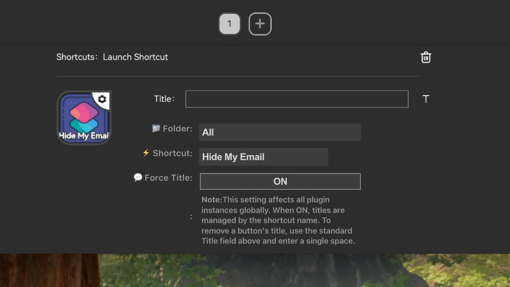

# Mac Shortcuts Plugin for Mirabox StreamDock



A plugin for Mirabox StreamDock that allows you to execute Mac Shortcuts directly from your StreamDock buttons.

> ⚠️ **IMPORTANT**: This plugin is **macOS ONLY**. It will NOT work on Windows systems as it relies on Apple's Shortcuts app which is exclusive to macOS.

> **Based on**: This plugin is based on and inspired by the excellent work of [SENTINELITE's StreamDeck-Shortcuts](https://github.com/SENTINELITE/StreamDeck-Shortcuts) plugin. We've adapted it to work specifically with Mirabox StreamDock devices.

## 🚀 Features

- **Direct execution**: Launch any Mac Shortcut with a single click from your StreamDock
- **Folder navigation**: Organize and navigate through your shortcuts structured in folders
- **Integrated search**: Quickly find any shortcut using the search function
- **Customizable titles**: Override the title displayed on each button
- **Universal compatibility**: Supports both Intel x86_64 and Apple Silicon ARM64
- **Intuitive interface**: Web Property Inspector with dark theme and responsive design
- **Mirabox compatibility**: Specifically optimized for Mirabox StreamDock devices

## 📋 Requirements

- **macOS**: 12.0 or higher
- **StreamDock Software**: 2.9 or higher (compatible with Stream Deck Software)
- **StreamDock**: Any compatible model

## 🔧 Installation

1. Visit [https://space.key123.vip](https://space.key123.vip)
2. Download the Mac Shortcuts plugin
3. The plugin will be automatically installed in your StreamDock Software
4. The plugin will appear in the "Shortcuts" category within StreamDock Software

### Manual Installation (for developers)

1. Clone or download this repository
2. Copy the `com.orumad.streamdock.macshortcuts.sdPlugin` folder to:
   ```
   ~/Library/Application Support/HotSpot/StreamDock/Plugins/
   ```
3. Restart StreamDock Software

## 🎯 Usage

1. **Drag** the "Launch Shortcut" action from the "Shortcuts" category to a button on your StreamDock
2. **Configure** the shortcut in the Property Inspector:
   - Select the folder where your shortcut is located
   - Choose the specific shortcut you want to execute
   - Optionally, customize the button title
3. **Press** the button on your StreamDock to execute the shortcut

### Searching for Shortcuts

- Use the "Search" button in the Property Inspector to open the search menu
- Type the name of the shortcut you're looking for
- Select the desired result from the filtered list

## 🏗️ Architecture

The plugin consists of several components:

- **`StreamDeck-Shortcuts`**: Universal native executable (Intel + Apple Silicon)
- **`StreamDock-Wrapper`**: Bash script that acts as the entry point
- **`pi/main_pi.html`**: Property Inspector web interface
- **`pi/main_pi.js`**: JavaScript logic for configuration
- **`manifest.json`**: Plugin configuration for StreamDock

## 🛠️ Development

### Project Structure

```
Mac-Shortcuts-plugin/
├── com.orumad.streamdock.macshortcuts.sdPlugin/
│   ├── Icons/                      # Plugin icons
│   ├── pi/                         # Property Inspector
│   │   ├── main_pi.html           # Web interface
│   │   ├── main_pi.js             # JavaScript logic
│   │   └── sdpi.css               # Styles
│   ├── StreamDeck-Shortcuts       # Main executable
│   ├── StreamDock-Wrapper         # Wrapper script
│   ├── manifest.json              # Plugin configuration
│   └── userSettings.json          # User settings
├── README.md
├── LICENSE.md
└── .gitignore
```

### How It Works

1. StreamDock executes `StreamDock-Wrapper` (bash script)
2. The wrapper processes and fixes JSON format for compatibility
3. Executes the `StreamDeck-Shortcuts` binary with corrected parameters
4. The Property Inspector communicates via WebSocket for configuration
5. When the button is pressed, the corresponding Mac Shortcut is executed

## 🤝 Contributing

Contributions are welcome! To contribute:

1. Fork the repository
2. Create a feature branch (`git checkout -b feature/new-feature`)
3. Commit your changes (`git commit -am 'Add new feature'`)
4. Push to the branch (`git push origin feature/new-feature`)
5. Open a Pull Request

### Reporting Bugs

If you find a bug, please open an [issue](https://github.com/orumad/Mac-Shortcuts-plugin/issues) with:

- Detailed description of the problem
- Steps to reproduce the bug
- macOS and StreamDock Software versions
- Logs or screenshots if possible

## 💬 Support

- **Discord**: Join our [Discord community](https://discord.gg/PnRT5gcn) for support and discussions
- **GitHub Issues**: For bugs and feature requests
- **Documentation**: Check the project wiki for detailed guides

## 📄 License

This project is licensed under the MIT License. See the [LICENSE.md](LICENSE.md) file for details.

## ✨ Acknowledgments

- **[SENTINELITE](https://github.com/SENTINELITE)** for the original [StreamDeck-Shortcuts plugin](https://github.com/SENTINELITE/StreamDeck-Shortcuts) that this project is based on
- [Elgato](https://www.elgato.com/) for the Stream Deck SDK that powers the underlying technology
- [Mirabox](https://mirabox.com/) for StreamDock device compatibility
- The Stream Deck developer community
- All contributors who have helped improve this project

## 📊 Project Status

- ✅ **Current version**: 1.0.0
- ✅ **Status**: Stable and in production
- 🔄 **Active development**: New features in development
- 🐛 **Maintenance**: Bug fixes and minor improvements

---

**Like this project?** ⭐ Give it a star on GitHub to support development!
